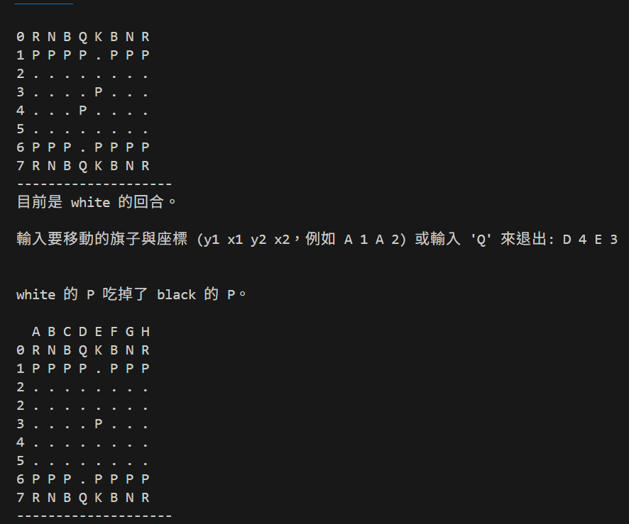

# ♟️ C++ Console Chess Game

這是一個使用 C++ 實作的國際象棋遊戲（Chess），透過命令列介面控制，每個棋子皆使用物件導向方式建構，並根據實際規則判斷合法移動。

## 📌 功能特色

- ✅ 完整棋盤初始化與顯示（支援 A–H、0–7 格式）
- ✅ 支援以下棋子移動規則：
  - 卒（Pawn）：前進、吃子、首回合雙步
  - 車（Rook）：直線移動
  - 馬（Knight）：L型跳躍
  - 象（Bishop）：斜線移動
  - 后（Queen）：車＋象的移動方式
  - 王（King）：任意方向一步
- ✅ 吃掉對方國王即結束（模擬勝利）
- ✅ 輸入格式簡單直覺：例如 `d 6 d 4`

## 🧱 程式架構

- 使用 C++ 類別設計（如 `Piece`, `Pawn`, `Rook`, ...）
- 棋盤以 `vector<vector<Piece*>>` 儲存
- 利用虛擬函數實作不同棋子的移動行為（多型）
- 控制流程與提示皆在 Console 命令列完成

## ▶️ 操作方式

### 輸入格式：
y1 x1 y2 x2

範例輸入：
e 2 e 4
g 1 f 3

### 特別說明：

- 棋盤左邊顯示行數（0–7），上方顯示列（A–H）
- 支援大寫或小寫輸入（如 `D 2 D 4` 或 `d 2 d 4` 均可）

---

## 🛠️ 建置方式

### 方法一（使用 g++ 編譯）：

```bash
g++ -std=c++11 FinalProject.cpp -o chess
./chess

方法二（使用 VS Code）：
安裝 C++ 擴充套件（如 C/C++ from Microsoft）

打開 FinalProject.cpp

點選右上角 ▶️ 執行或在終端輸入編譯指令

## 📸 遊戲畫面截圖



## 📚 延伸功能（未來可實作）

- ⏳ 回合時間限制（每人有固定秒數）
- ♜ 棋子移動動畫（以文字模擬動畫或圖形介面呈現）
- ♚ 特殊規則：
  - 王車易位（Castling）
  - 升變（Promotion）
  - 吃過路兵（En Passant）
- 💾 存檔與讀檔功能（支援中斷後繼續）
- 🌐 加入網路對戰或雙人模式

## 🧑‍💻 作者

- GitHub: [@yusungko](https://github.com/yusungko)
- 專案名稱：`chess-cpp`
